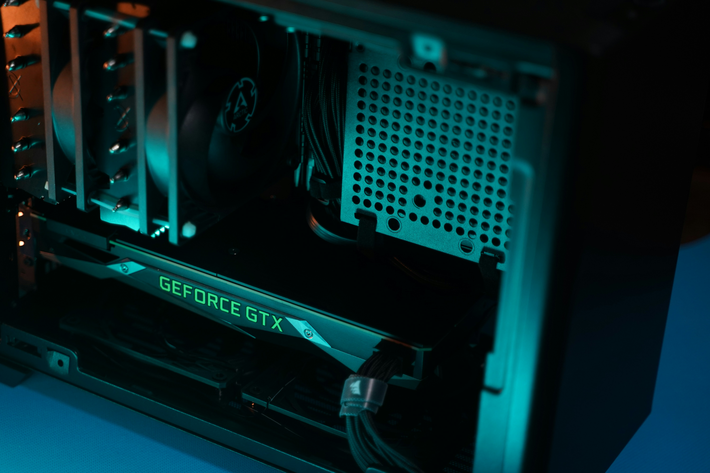

# Dxmostacero `Homelab`

Hey, there!

"Hi, I'm Dxmostacero, a tech enthusiast passionate about IT infrastructure, cybersecurity, and content aimed at IT professionals and Homelab nerds."

This Homelab repository contains all my documentation files. Here, you’ll find notes, detailed configurations, and resources for the infrastructure.

# Contribution
As this is my personal Homelab documentation, I don't accept any contributions. But feel free to fork this repository and use it for your own documentation.