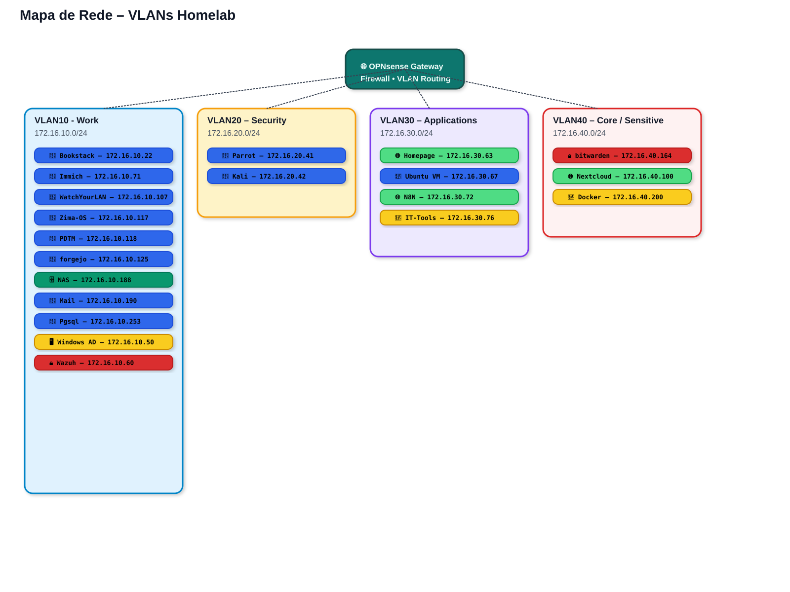
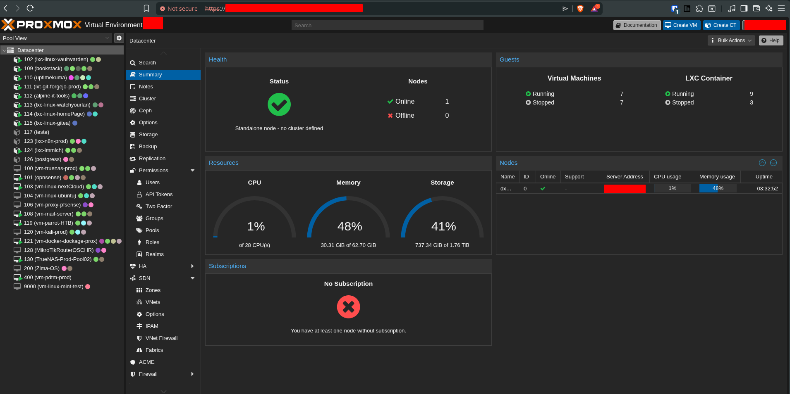
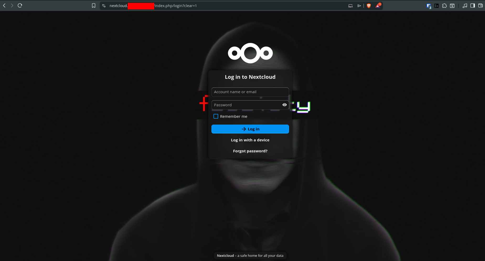
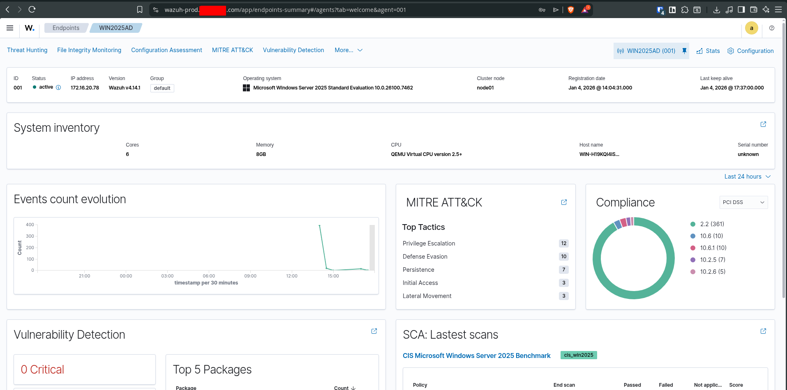

  <a href="#pt-br">🇧🇷 Português</a> •
  <a href="#en-us">🇺🇸 English</a>

---

# 🖥️ Homelab – Infraestrutura e Segurança da Informação

Este repositório mostra a estrutura do meu **homelab**, criado como um espaço para estudar **infraestrutura, redes e segurança da informação**. O objetivo é simular situações parecidas com as de empresas reais, permitindo que eu pratique conceitos como **segmentação de rede, controle de acesso, monitoramento, hardening e isolamento de serviços** de forma segura.

No centro do homelab está o **OPNsense**, que funciona como gateway, firewall e roteador entre diferentes VLANs. Cada VLAN tem um propósito específico, separando serviços de trabalho, aplicações, ambientes de segurança e sistemas mais sensíveis. Isso ajuda a manter a rede organizada, mais segura e facilita a aplicação de regras e políticas de acesso.

Para acessar o ambiente de forma segura, utilizo **VPN WireGuard**, que permite conectar remotamente às VLANs e controlar o acesso sem comprometer a segurança do laboratório. Dessa forma, consigo testar e aprender sobre redes isoladas sem afetar outros serviços.

No homelab rodam servidores Linux, Active Directory, bancos de dados, ferramentas de monitoramento, NAS, aplicações web, automações, ambientes de pentest e serviços críticos, como **gerenciamento de senhas e containers Docker**. Este projeto é meu espaço de aprendizado prático, onde posso validar conceitos e desenvolver habilidades em **infraestrutura e segurança da informação**, com controle total sobre o ambiente.

---

## 🌐 Gateway
- **Dispositivo**: OPNsense Gateway
- **Função**: Firewall e Roteamento VLAN
- **IP**: 172.16.10.1

---

## 🟦 VLAN10 – Work
- **Faixa de IP**: `172.16.10.0/24`
- **Função**: Servidores gerais, Windows AD, Wazuh, NAS

#### 
Hosts VLAN10

| Host | Tipo | IP |
|------|------|----|
| 🐧 Bookstack | Linux | 172.16.10.22 |
| 🐧 Immich | Linux | 172.16.10.71 |
| 🐧 WatchYourLAN | Linux | 172.16.10.107 |
| 🐧 Zima-OS | Linux | 172.16.10.117 |
| 🐧 PDTM | Linux | 172.16.10.118 |
| 🐧 Forgejo | Linux | 172.16.10.125 |
| 🗄️ NAS | Storage | 172.16.10.188 |
| 🐧 Mail | Linux | 172.16.10.190 |
| 🐧 PgSQL | Linux | 172.16.10.253 |
| 🖥️ Windows AD | Windows Server | 172.16.10.50 |
| 🔒 Wazuh | Security / Endpoint | 172.16.10.60 |

---

## 🟨 VLAN20 – Security
- **Faixa de IP**: `172.16.20.0/24`
- **Função**: Segurança / Pen-testing

#### 
Hosts VLAN20

| Host | Tipo | IP |
|------|------|----|
| 🐧 Parrot | Linux | 172.16.20.41 |
| 🐧 Kali | Linux | 172.16.20.42 |

---

## 🟪 VLAN30 – Applications
- **Faixa de IP**: `172.16.30.0/24`
- **Função**: Aplicações web e ferramentas

#### 
Hosts VLAN30

| Host | Tipo | IP |
|------|------|----|
| 🌐 Homepage | Web Server | 172.16.30.63 |
| 🐧 Ubuntu VM | Linux | 172.16.30.67 |
| 🌐 N8N | Web / Automation | 172.16.30.72 |
| 🔧 IT-Tools | Ferramentas | 172.16.30.76 |

---

## 🟥 VLAN40 – Core / Sensitive
- **Faixa de IP**: `172.16.40.0/24`
- **Função**: Serviços sensíveis e core

#### 
Hosts VLAN40

| Host | Tipo | IP |
|------|------|----|
| 🔒 Bitwarden | Password Manager | 172.16.40.164 |
| 🌐 Nextcloud | File Server | 172.16.40.100 |
| 🔧 Docker | Containers / Apps | 172.16.40.200 |

---

## 📊 Infográfico da Rede

  

---
## 🚀 Aplicações em Produção / Running Applications

### Proxmox

  

### Nextcloud

  

### Wazuh

  

### ProxMenux Monitor

  

---

# 🖥️ Homelab – Infrastructure & Information Security

This repository shows the structure of my **homelab**, created as a hands-on space for studying **infrastructure, networking, and information security**. The goal is to simulate scenarios similar to real corporate environments, allowing me to practice **network segmentation, access control, monitoring, hardening, and service isolation** safely.

At the core of the homelab is **OPNsense**, which acts as the gateway, firewall, and router between different VLANs. Each VLAN has a specific purpose, separating work services, applications, security environments, and more sensitive systems. This helps keep the network organized, secure, and makes it easier to apply rules and access policies.

For secure remote access, I use **WireGuard VPN**, which allows connecting to the VLANs while keeping the lab isolated and secure. This lets me test and learn about isolated networks without affecting other services.

The homelab runs Linux servers, Active Directory, databases, monitoring tools, NAS storage, web applications, automation tools, pentesting environments, and critical services like **password management and Docker containers**. This project is my practical learning space, where I can validate concepts and develop skills in **infrastructure and information security**, with full control over the environment.

---

## 🌐 Gateway
- **Device**: OPNsense Gateway
- **Role**: Firewall & VLAN Routing
- **IP**: 172.16.10.1

---

## 🟦 VLAN10 – Work
- **IP Range**: `172.16.10.0/24`
- **Purpose**: General servers, Windows AD, Wazuh, NAS

#### 
Hosts VLAN10

| Host | Type | IP |
|------|------|----|
| 🐧 Bookstack | Linux | 172.16.10.22 |
| 🐧 Immich | Linux | 172.16.10.71 |
| 🐧 WatchYourLAN | Linux | 172.16.10.107 |
| 🐧 Zima-OS | Linux | 172.16.10.117 |
| 🐧 PDTM | Linux | 172.16.10.118 |
| 🐧 Forgejo | Linux | 172.16.10.125 |
| 🗄️ NAS | Storage | 172.16.10.188 |
| 🐧 Mail | Linux | 172.16.10.190 |
| 🐧 PgSQL | Linux | 172.16.10.253 |
| 🖥️ Windows AD | Windows Server | 172.16.10.50 |
| 🔒 Wazuh | Security / Endpoint | 172.16.10.60 |

---

## 🟨 VLAN20 – Security
- **IP Range**: `172.16.20.0/24`
- **Purpose**: Security / Pen-testing

#### 
Hosts VLAN20

| Host | Type | IP |
|------|------|----|
| 🐧 Parrot | Linux | 172.16.20.41 |
| 🐧 Kali | Linux | 172.16.20.42 |

---

## 🟪 VLAN30 – Applications
- **IP Range**: `172.16.30.0/24`
- **Purpose**: Web applications and tools

#### 
Hosts VLAN30

| Host | Type | IP |
|------|------|----|
| 🌐 Homepage | Web Server | 172.16.30.63 |
| 🐧 Ubuntu VM | Linux | 172.16.30.67 |
| 🌐 N8N | Web / Automation | 172.16.30.72 |
| 🔧 IT-Tools | Tools | 172.16.30.76 |

---

## 🟥 VLAN40 – Core / Sensitive
- **IP Range**: `172.16.40.0/24`
- **Purpose**: Critical and sensitive services

#### 
Hosts VLAN40

| Host | Type | IP |
|------|------|----|
| 🔒 Bitwarden | Password Manager | 172.16.40.164 |
| 🌐 Nextcloud | File Server | 172.16.40.100 |
| 🔧 Docker | Containers / Apps | 172.16.40.200 |

---

## 📊 Network Infographic

  

## 🚀 Production / Running Applications

### Proxmox

  

### Nextcloud

  

### Wazuh

  

### ProxMenux Monitor

  

