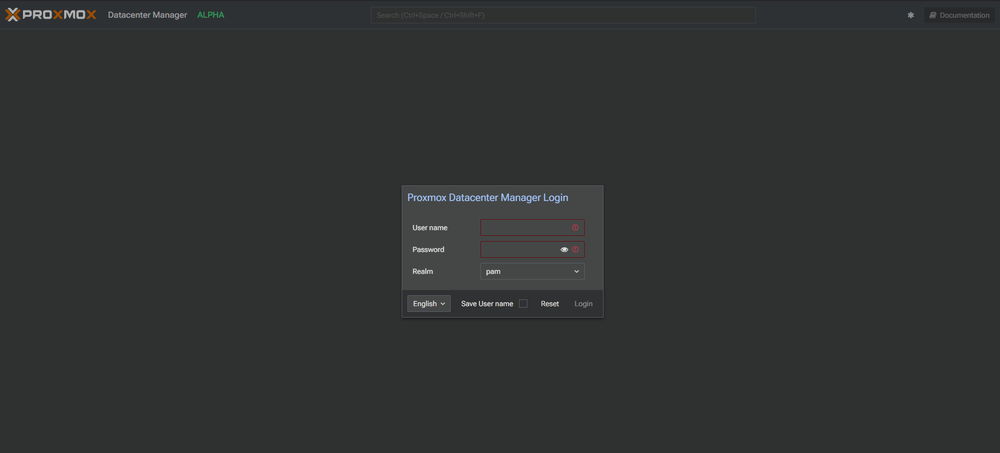

## Adicionando o repositorio do `pdm-test`

```sh
echo 'deb http://download.proxmox.com/debian/pdm bookworm pdm-test' >/etc/apt/sources.list.d/pdm-test.list
```

Obtendo as chaves `gpg`

```sh
wget https://enterprise.proxmox.com/debian/proxmox-release-bookworm.gpg -O /etc/apt/trusted.gpg.d/proxmox-release-bookworm.gpg
```

```sh
sudo apt update
```

### Instalando o `proxmox-datacenter-manager`

```sh
apt install proxmox-datacenter-manager proxmox-datacenter-manager-ui
```

Acessar atravez da `url` e  realizar o login como `root@pam`

```sh
https://IP-OR-HOSTNAME:8443
```



